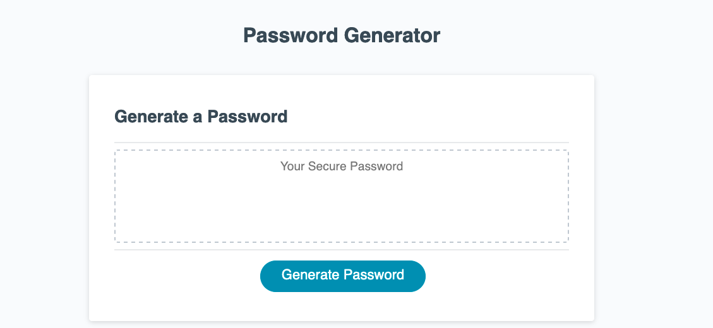

# [Password Generator](https://avaarm.github.io/03-Javascript-Password-Generator/)
<!-- 
 -->

## Description 

My first front-end/ client-side javascript application. As the only programming language native to web browsers, JavaScript is used all over the web and I was able to see first hand at how versatile it can through this application. 

I modified starter code to create an application that enables employees to generate random passwords based on criteria that they’ve selected. This app runs in the browser and features dynamically updated HTML and CSS powered by JavaScript code that I wrote. It has a clean and polished, responsive user interface that adapts to multiple screen sizes.

## Table of Contents

* [Description](#Description)
* [Technologies](#technologies)
* [Application](#Application)
* [Acknowledgements](#acknowledgements)
* [Questions](#questions)

## Technologies

* JavaScript
* Bootstrap
* Animate.css
* HTML
* CSS
* Github Pages

## Application 

## Acknowledgements

* UW Coding Bootcamp instructional team and classmates
    * skeleton of html files already provided
* [Bootstrap](https://getbootstrap.com/docs/4.1/getting-started/introduction/)

## Questions 

If you have any questions, please contact me on:
GitHub at [avaarm](https://github.com/avaarm)
Email at [Emma](mailto:emavanes95@mail.com)
